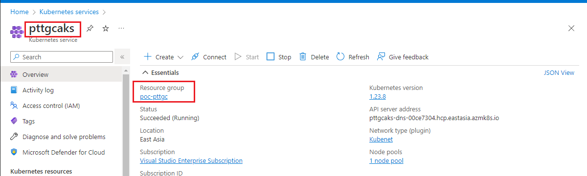
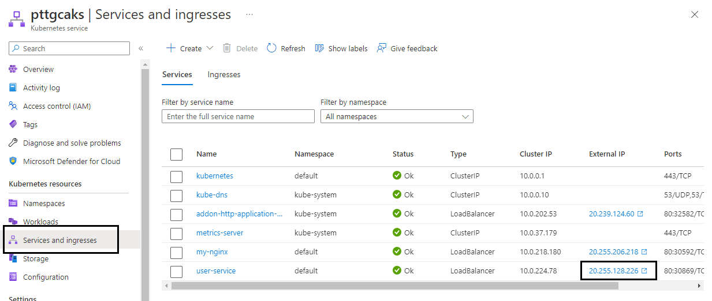
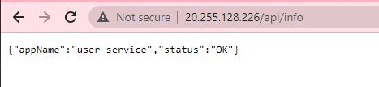
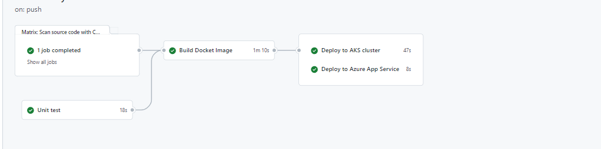
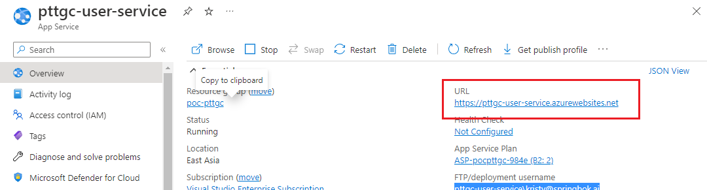
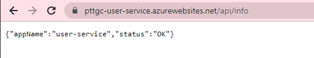

# Source code scanning

## PREREQUISITE
### Create Repository Secrets
`REGISTRY_LOGIN_SERVER`
`REGISTRY_USERNAME`
`REGISTRY_PASSWORD`

1. Login to Azure portal 

[Azure_Portal](https://azure.microsoft.com/en-us/get-started/azure-portal/)

2. Select Azure cloud Shell


3. First command to login to ACR. 
 
 ```console
 
export RESOURCE_GROUP="$(az group list --query "[?location=='eastasia']" | jq -r '.[0].name')"

 groupId=$(az group show \
   --name ${RESOURCE_GROUP} \
   --query id --output tsv)
 ```

4. Second command to login to ACR. create the service principal (Copy clientId and clientSecret please see detail in step 7.)
 
  ```console
 az ad sp create-for-rbac \
  --scope $groupId \
  --role Contributor \
  --sdk-auth
  ```
 
 

5. Third command to login to ACR. Please change <registry-name> to your registry name from step 4.
 
 ```console
 export REPO_NAME="$(az acr list | jq -r '.[].name')"
 ```

```console
 registryId=$(az acr show \
   --name ${REPO_NAME} \
   --query id --output tsv)
 ```
   
 
6. Fourth command to login to ACR. Please change <ClientId> to your clientId or app id from step 4. And please keep the result.

  ```console
 az role assignment create \
  --assignee <ClientId> \
  --scope $registryId \
  --role AcrPush
  ```
 

 
7. Get `REGISTRY_LOGIN_SERVER`
 
   ```console
   az acr list | jq -r '.[].loginServer'
   ```
 
8. Create Github Repo.

 In the GitHub UI, navigate to your forked repository and select Settings > Secrets > Actions and Select New repository secret to add the following secrets:


Reference : https://docs.microsoft.com/en-us/azure/container-instances/container-instances-github-action

---

## Exercise 1
### Create AKS CD workflow
From file `.github/workflows/build-workflow.yml`, there are CI jobs already provided, most of the job's detail are from the previous lab. In this lab we will add the CD jobs to deploy the built image to AKS cluster

*Additional Prerequisites*
- AKS Cluster name (Login to Azure Portal, Kubernetes Service, and get the cluster name from `Overview` menu)
- Resource Group name 



1. Create repository secret name `AKS_CLUSTER_NAME` with the AKS cluster name value
2. Create repository secret name `AZURE_RESOURCE_GROUP` with the resource group name
3. Create repository secret name `AZURE_CREDENTIALS` with the json value from `Prerequisites` step#6


4. Create repository secret name `REGISTRY_LOGIN_SERVER` (See `Prerequisites` section)
5. Create repository secret name `REGISTRY_USERNAME` (See `Prerequisites` section)
6. Create repository secret name `REGISTRY_PASSWORD` (See `Prerequisites` section)

7. Update `./manifests/deployment.yaml` at line 25
` pttgcacr.azurecr.io/user-service:unstable` to `<your REGISTRY LOGIN SERVER>/user-service:unstable`

8. Update `.github/workflows/build-workflow.yml` and add the AKS deployment step as below
```yaml
  deploy-aks:
    name: Deploy to AKS cluster
    runs-on: ubuntu-latest
    needs: containerized

    steps:
      - name: Checkout 
        uses: actions/checkout@v3
      - name: Azure Login
        uses: azure/login@v1
        with:
          creds: ${{ secrets.AZURE_CREDENTIALS }}
          audience: api://githubAction
      - name: Get K8S context
        uses: azure/aks-set-context@v3
        with:
          resource-group: ${{ secrets.AZURE_RESOURCE_GROUP }}
          cluster-name: ${{ secrets.AKS_CLUSTER_NAME }}
        id: login 
      - name: Deploy Application
        uses: azure/k8s-deploy@v3
        with:
          manifests: ./manifests/deployment.yaml
          images: |
            ${{ secrets.REGISTRY_LOGIN_SERVER }}/user-service:${{ github.sha }}
```

9. Commit & Push the code Then monitor the running workflows to see how it's running
10. Once the deployment is done. Go go Azure Portal, Kubernetes Services. Then go to menu, `Services and ingresses`, click on `External IP` for `user-service` record

Example:



This repository is a simple RESTful API, we can see the application info from this api (by append the `/api/info` to the path)

Example:




## Exercise 2
### Deploy same image to Azure App Service

Objective of this workflow jobs is to demonstrate that we can reuse the same CI (Continuous Integration) workflow while still able to deploy the image to either AKS, Azure App Service or both.

This exercise we will extend `.github/workflows/build-workflow.yml` to also deploy the built image to Azure App Service as well.

1. Login to Azure Portal, App Services, you should see the app service that contain name `userservice` already created for you.
2. `Overview` page, click `Get publish profile` to download the publish profile file
3. In your github repository, create repository secret name `AZURE_WEBAPP_PUBLISH_PROFILE` and copy all the content from file that downloaded from step#2 as a value of this secret.
4. Add another job to `.github/workflows/build-workflow.yml` to deploy the same image to Azure App Service 

Example:
```yaml
deploy-app-service:
    name: Deploy to Azure App Service
    runs-on: ubuntu-latest
    needs: containerized

    steps:
      - name: deploy dev slot
        uses: azure/webapps-deploy@v2
        with:
          #app-name: 'pttgc-simple-app'
          app-name: 'pttgc-user-service'
          # Add publish profile from secret that created from publish profile which we downloaded from Azure Portal
          publish-profile: ${{ secrets.AZURE_WEBAPP_PUBLISH_PROFILE }}
          slot-name: production
          images:  ${{ secrets.REGISTRY_LOGIN_SERVER }}/user-service:${{ github.sha }}
```
*NOTE: `app-name:` should be the value of your app services, please check the Azure Portal to get the exact name of your app service, it's the same name from step#1*

5. Commit & Push the code, then monitor your workflow, to see how it's running.

You should see something like this



6. Login to your Azure Portal, App Services then go to your userservice app services

7. On `Overview` page, click on the `URL` to validate the app

Example:


8. Since our `user-service` app is a RESTful API and provide the api `/api/info`, append this path to your url from step#7. You should see the response like this




## References
- The completed workflow also provided in `.github/workflows/build-final.yml`

